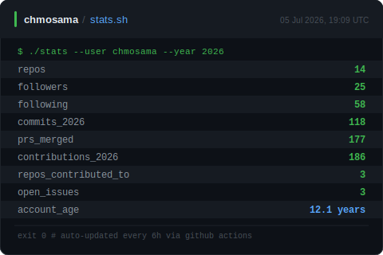

<div align="center">

[](https://git.io/typing-svg)

<br/>

[](https://www.chmosama.com)
[](https://linkedin.com/in/chmosama)
[](https://www.chmosama.com/blog)

</div>

---

```zsh
$ cat /etc/profile.d/osama.conf

NAME="Choudhary Muhammad Osama"
ROLE="Senior Security Engineer"
DOMAINS=(Red-Teaming AppSec DevSecOps)
```

---

<div align="center">

### 📊 GitHub Stats

<picture>
  <source media="(prefers-color-scheme: dark)"  srcset="dark_mode.svg">
  <source media="(prefers-color-scheme: light)" srcset="light_mode.svg">
  
</picture>

</div>
